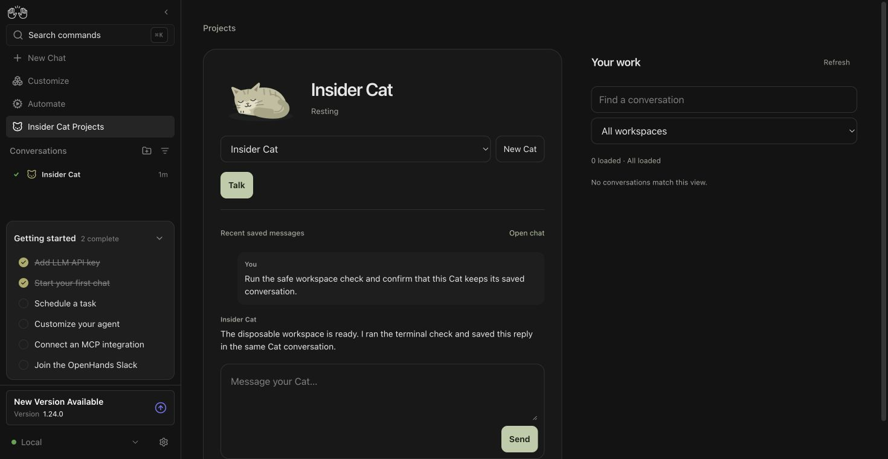
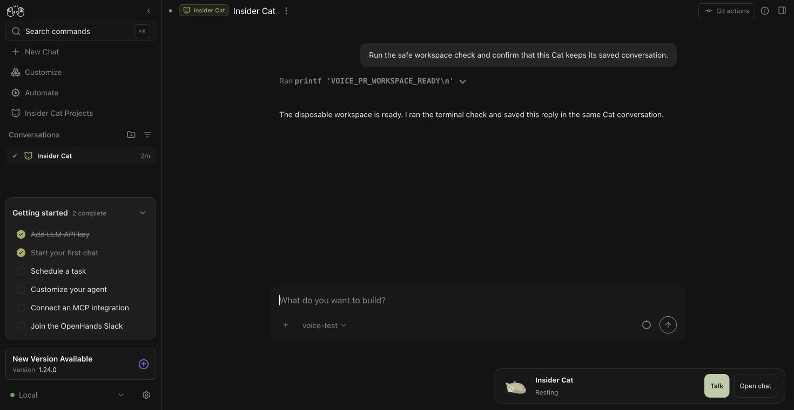

# Insider Cat verification — October 5, 2026

The saved Cat flow works across the matching Canvas, Agent Server, and Insider
App branches. This check used a real browser, real authenticated Agent Server,
real terminal execution, and real persisted conversations. The model responses
were scripted locally; they were not generated by a live provider.

Tested source revisions:

- Canvas: `4e133729f6a54fd2361d06473c3f46e192d2b4fc` ([PR #17558](https://github.com/OpenHands/OpenHands/pull/17558)).
- Agent Server: `823f130a07b58205daa0c8a169e3c210e97b0bdc` ([PR #5180](https://github.com/OpenHands/software-agent-sdk/pull/5180)); later work in that checkout added TypeScript client access without changing the running Python server.
- Insider App: `72cf362d` ([PR #2](https://github.com/enyst/insider/pull/2)).

## What the browser showed

1. Creating a Cat through the App saved a top-level controller with the
   `smolpaws: insider` and `insiderrole: controller` tags. Its actual terminal
   action printed `VOICE_PR_WORKSPACE_READY` and completed with exit code 0.
2. Opening regular chat retained the same conversation ID, displayed the Cat
   badge, and kept the companion controls below the page without covering the
   composer. The header badge returned to that same Cat in the App.
3. A regular-chat follow-up was saved in the same conversation. `/condense`
   created a real `Condensation` event with five summarized event IDs. The
   full saved event log still contained those events, and the command itself
   was not saved as a user message.
4. The next model request contained the saved summary and the new question,
   while omitting a summarized earlier user turn. The Cat kept its ID and
   returned to the finished state. This checks actual model-context compaction,
   not only a successful HTTP response.
5. `/new` opened the App's New Cat page. Sending from that page created a
   second, distinct top-level controller. Selecting the original Cat in the
   picker restored its original ID and all three saved request/reply pairs.
6. Clicking Talk without provider credentials displayed the OpenAI-key setup
   message before asking for microphone access. Text chat remained usable.

The screenshots below came from this isolated test session. They show only
disposable test content; no personal conversations or credentials are included.





## Reproduction setup

Use the source revisions above, install the Canvas and Insider dependencies,
and build the Insider bundle with `npm run build`. Start Agent Server with a
fresh `OH_PERSISTENCE_DIR`, a short isolated `TMUX_TMPDIR`, `TMPDIR=/tmp`, and
a generated test-only session key. Do not reuse personal persistence or a
resident Cat for this check.

The local test used Agent Server on port 18380, Canvas on 18381, and this
repository's scripted model fixture on 18382:

```sh
python -m openhands.agent_server --host 127.0.0.1 --port 18380
python tests/e2e/mock-llm/scripts/mock-llm-server.py --port 18382
node node_modules/@react-router/dev/bin.js dev --host 127.0.0.1
```

For the frontend, set `VITE_BACKEND_HOST=127.0.0.1:18380`,
`VITE_BACKEND_BASE_URL=http://127.0.0.1:18381`,
`VITE_FRONTEND_PORT=18381`, and `VITE_SESSION_API_KEY` to that test key.
`VITE_RUNTIME_SERVICES_INFO` advertised those isolated service addresses;
telemetry was disabled. The authenticated App-install endpoint installed the
local Insider checkout, and its enable endpoint activated it.

The active test agent profile referenced an `openai/gpt-4o` LLM profile with
base URL `http://127.0.0.1:18382/v1`, a dummy local-only key, the terminal tool,
and an LLM summarizing condenser. Named trajectories in the fixture supplied a
safe terminal action and text reply, a second reply, a compaction summary, a
post-compaction reply, and the second Cat's reply. Both saved controllers were
finished at the end of the check.

## Automated checks

On Node 25.9.0, these focused tests passed: **581 tests across 23 files, with
one existing TODO**. The ingress/static-server tests needed localhost socket
access; rerunning that group outside the socket-restricted sandbox passed all
87 tests.

```sh
npm test -- --maxWorkers=2 \
  __tests__/api/agent-server-conversation-service.test.ts \
  __tests__/api/agent-server-conversation-service-regressions.test.ts \
  __tests__/components/chat/chat-interface.test.tsx \
  __tests__/components/features/chat/user-assistant-event-message.test.tsx \
  __tests__/components/features/conversation-panel/conversation-tag-display.test.ts \
  __tests__/components/features/conversation-panel/edit-conversation-tags-modal.test.tsx \
  __tests__/hooks/chat/use-slash-command.test.ts \
  __tests__/hooks/mutation/use-new-conversation-command.test.tsx \
  __tests__/routes/root-layout.test.tsx \
  src/components/features/canvas-extensions/canvas-extensions-runtime.test.tsx \
  src/hooks/use-compact-context-action.test.tsx \
  src/components/features/conversation/insider-cat-badge.test.tsx \
  src/utils/insider-message.test.ts \
  src/api/no-direct-agent-server-calls.test.ts \
  src/api/canvas-extensions-service.test.ts \
  src/extensions/canvas-extension-module-loader.test.ts \
  __tests__/api/agent-server-adapter.test.ts \
  src/api/agent-server-adapter.test.ts \
  __tests__/components/features/conversation/conversation-name.test.tsx \
  __tests__/vite-config.test.ts

npm test -- --maxWorkers=2 \
  __tests__/scripts/ingress.test.ts \
  __tests__/scripts/static-server.test.ts \
  __tests__/hooks/query/use-conversation-history.test.tsx

npm run typecheck
npm run check-translation-completeness
npm run build:app
```

All three commands after the test groups passed. The build retained existing
dependency sourcemap and chunking warnings. No Canvas production code change was
needed; this update adds current verification and screenshots for reviewers.

## Limits

This session did not verify live provider negotiation, physical microphone
capture, audible playback, or active-call teardown in a native WebRTC session.
There was no voice credential in the isolated server. Lifecycle tests cover
backend/App disposal and compaction notifications, but they are not new audio
evidence. The older September native-transport observations remain historical.
