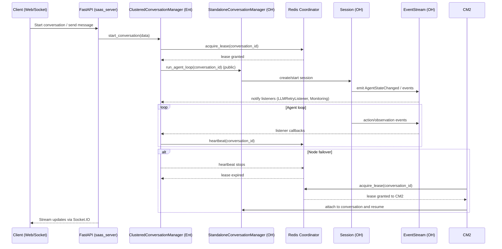

# Migrating Enterprise Private-Method Usages to Public OpenHands APIs

This document maps current enterprise usages of OpenHands (OH) private methods to a proposed public API, and provides a sequence diagram of the distributed conversation flow.

## Scope
- Calls made from enterprise to OH private methods (direct or via inheritance where the target is defined privately in OH and not overridden in enterprise).
- Representative migration guidance and API targets for each category.
- Distributed conversation lifecycle sequence diagram (Mermaid).

## Private usages and public replacements

1) Session retry notifications
- Current private usage:
  - OH definition: `openhands/server/session/session.py:306 def _notify_on_llm_retry(self, retries: int, max: int)`
  - Enterprise usage: `enterprise/server/saas_nested_conversation_manager.py:722` (calls on OH Session)
- Problem: requires reaching into OH private session behavior.
- Public replacement:
  - EventStream + LLMRetryListener interface (public). Handlers subscribe to LLM retry events without touching Session internals.
  - API sketch:
    - `EventStream.subscribe(listener: EventListener)`
    - `class LLMRetryListener(EventListener): on_llm_retry(session_id, retries, max)`

2) Provider service construction
- Current private usage:
  - OH definition: `openhands/integrations/provider.py:149 def _get_service(self, provider)`
  - Enterprise usage: `enterprise/server/routes/auth.py:429` (provider_handler._get_service)
- Problem: bypasses ProviderHandler’s public surface and encourages private call sites.
- Public replacement:
  - `ProviderHandler.get_service(provider: ProviderType) -> GitService` (public)
  - `TokenSource` boundary supplies tokens; GitService exposes only public HTTP methods (list_repos, create_pr, etc.).

3) Conversation URL helper
- Current private usage:
  - OH definition: `openhands/server/conversation_manager/standalone_conversation_manager.py:737 def _get_conversation_url(...)`
  - Enterprise usage: `enterprise/server/clustered_conversation_manager.py:416, 686`
- Problem: innocuous but private, creates coupling.
- Public replacement:
  - `ConversationURL.build(conversation_id: str, base_host: str | Request) -> str`
  - Alternatively: expose via `ConversationManager.get_conversation_url(conversation_id)`.

4) Parent private loop methods via super()
- Pattern: enterprise subclasses rely on parent’s private loop methods (e.g., `_start_agent_loop`) through `super()`.
- Problem: tight coupling to parent internals; brittle across versions.
- Public replacement:
  - `ConversationManagerABC` exposes `start_conversation`, `run_agent_loop`, and lifecycle hooks (`before_start`, `after_end`).
  - Subclasses compose orchestration via documented hooks rather than private overrides.

5) Direct HTTP helpers on provider services
- Pattern: enterprise services sometimes reach `_make_request` on provider classes.
- Problem: private transport leakage; bypasses validation/interceptors.
- Public replacement:
  - Public GitService methods cover supported actions; extension points via request middlewares or `on_before_request/after_response` hooks.

6) Storage namespacing via user_id
- Pattern: enterprise code pushes `user_id` through many APIs to derive storage paths.
- Problem: identity concerns leak into core semantics.
- Public replacement:
  - `UserContext.paths: ConversationPaths` provides path helpers; `user_id` becomes an implementation detail of the context.

## Dynamic overrides (enterprise) and load locations (OH)

- Server configuration class
  - Definition (enterprise): SaaSServerConfig defines override targets (settings, secrets, conversation store/manager, monitoring, user auth)
    - https://github.com/All-Hands-AI/OpenHands/blob/989a4e662bb8d388f73a6ec731985b7bbaea8942/enterprise/server/config.py#L52-L74
  - Load point (OH): load_server_config resolves OPENHANDS_CONFIG_CLS and instantiates the ServerConfig implementation
    - https://github.com/All-Hands-AI/OpenHands/blob/989a4e662bb8d388f73a6ec731985b7bbaea8942/openhands/server/config/server_config.py#L53-L62

- ConversationManager implementation
  - Definition (enterprise): conversation_manager_class → server.clustered_conversation_manager.ClusteredConversationManager
    - Definition reference: https://github.com/All-Hands-AI/OpenHands/blob/989a4e662bb8d388f73a6ec731985b7bbaea8942/enterprise/server/config.py#L64-L67
    - Class file (enterprise): https://github.com/All-Hands-AI/OpenHands/blob/989a4e662bb8d388f73a6ec731985b7bbaea8942/enterprise/server/clustered_conversation_manager.py
  - Load point (OH): ConversationManagerImpl via get_impl using server_config.conversation_manager_class
    - https://github.com/All-Hands-AI/OpenHands/blob/989a4e662bb8d388f73a6ec731985b7bbaea8942/openhands/server/shared.py#L61-L66

- SettingsStore implementation
  - Definition (enterprise): settings_store_class → storage.saas_settings_store.SaasSettingsStore
    - https://github.com/All-Hands-AI/OpenHands/blob/989a4e662bb8d388f73a6ec731985b7bbaea8942/enterprise/server/config.py#L59-L60
  - Load point (OH): SettingsStoreImpl via get_impl using server_config.settings_store_class
    - https://github.com/All-Hands-AI/OpenHands/blob/989a4e662bb8d388f73a6ec731985b7bbaea8942/openhands/server/shared.py#L68

- SecretsStore implementation
  - Definition (enterprise): secret_store_class → storage.saas_secrets_store.SaasSecretsStore
    - https://github.com/All-Hands-AI/OpenHands/blob/989a4e662bb8d388f73a6ec731985b7bbaea8942/enterprise/server/config.py#L60-L61
  - Load point (OH): SecretsStoreImpl via get_impl using server_config.secret_store_class
    - https://github.com/All-Hands-AI/OpenHands/blob/989a4e662bb8d388f73a6ec731985b7bbaea8942/openhands/server/shared.py#L70

- ConversationStore implementation
  - Definition (enterprise): conversation_store_class → storage.saas_conversation_store.SaasConversationStore
    - https://github.com/All-Hands-AI/OpenHands/blob/989a4e662bb8d388f73a6ec731985b7bbaea8942/enterprise/server/config.py#L61-L64
  - Load point (OH): ConversationStoreImpl via get_impl using server_config.conversation_store_class
    - https://github.com/All-Hands-AI/OpenHands/blob/989a4e662bb8d388f73a6ec731985b7bbaea8942/openhands/server/shared.py#L72-L76

- MonitoringListener implementation
  - Definition (enterprise): monitoring_listener_class → server.saas_monitoring_listener.SaaSMonitoringListener
    - https://github.com/All-Hands-AI/OpenHands/blob/989a4e662bb8d388f73a6ec731985b7bbaea8942/enterprise/server/config.py#L68-L71
  - Load point (OH): MonitoringListenerImpl via get_impl using server_config.monitoring_listener_class
    - https://github.com/All-Hands-AI/OpenHands/blob/989a4e662bb8d388f73a6ec731985b7bbaea8942/openhands/server/shared.py#L54-L59

- UserAuth implementation
  - Definition (enterprise): user_auth_class → server.auth.saas_user_auth.SaasUserAuth
    - https://github.com/All-Hands-AI/OpenHands/blob/989a4e662bb8d388f73a6ec731985b7bbaea8942/enterprise/server/config.py#L71-L74
  - Load point (OH): get_impl(UserAuth, server_config.user_auth_class)
    - https://github.com/All-Hands-AI/OpenHands/blob/989a4e662bb8d388f73a6ec731985b7bbaea8942/openhands/server/user_auth/user_auth.py#L88-L89

- Git service implementations (used by MCP tools and ProviderHandler)
  - Impl resolution points (OH):
    - GitHub: GithubServiceImpl = get_impl(GitHubService, OPENHANDS_GITHUB_SERVICE_CLS)
      - https://github.com/All-Hands-AI/OpenHands/blob/989a4e662bb8d388f73a6ec731985b7bbaea8942/openhands/integrations/github/github_service.py#L75-L78
    - GitLab: GitLabServiceImpl = get_impl(GitLabService, OPENHANDS_GITLAB_SERVICE_CLS)
      - https://github.com/All-Hands-AI/OpenHands/blob/989a4e662bb8d388f73a6ec731985b7bbaea8942/openhands/integrations/gitlab/gitlab_service.py#L79-L82
    - Bitbucket: BitBucketServiceImpl = get_impl(BitBucketService, OPENHANDS_BITBUCKET_SERVICE_CLS)
      - https://github.com/All-Hands-AI/OpenHands/blob/989a4e662bb8d388f73a6ec731985b7bbaea8942/openhands/integrations/bitbucket/bitbucket_service.py#L64-L67
  - Creation points (OH MCP tools):
    - GitHub create_pr constructs GithubServiceImpl
      - https://github.com/All-Hands-AI/OpenHands/blob/989a4e662bb8d388f73a6ec731985b7bbaea8942/openhands/server/routes/mcp.py#L117-L140
    - GitLab create_mr constructs GitLabServiceImpl
      - https://github.com/All-Hands-AI/OpenHands/blob/989a4e662bb8d388f73a6ec731985b7bbaea8942/openhands/server/routes/mcp.py#L190-L219
  - ProviderHandler mapping to service Impls (OH)
    - https://github.com/All-Hands-AI/OpenHands/blob/989a4e662bb8d388f73a6ec731985b7bbaea8942/openhands/integrations/provider.py#L128-L130

## Migration plan (phased)
- Phase 1: Introduce public APIs in OH (openhands.api.*) and adapters that forward to current internals with deprecation warnings.
- Phase 2: Update enterprise to:
  - Replace direct private calls with public APIs.
  - Register listeners for retry events instead of touching Session.
  - Consume ProviderHandler.get_service and TokenSource.
  - Use ConversationURL/ConversationManager public methods.
- Phase 3: Remove private usages and warnings; stabilize contracts with contract tests.

## Distributed conversation flow (sequence)

## Notes
- The Coordinator abstraction is shown explicitly; OH can ship a LocalCoordinator, enterprise provides RedisCoordinator.
- All interactions above use public APIs (CM.run_agent_loop, EventStream.subscribe, ProviderHandler.get_service, ConversationURL helper, RuntimeProvider).

